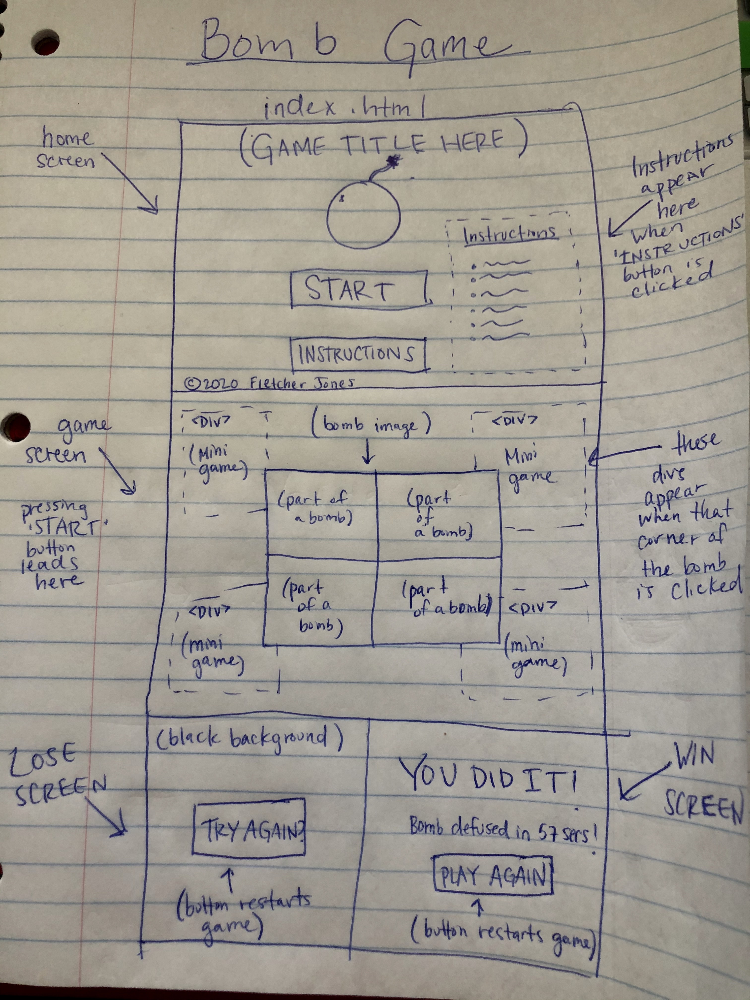

Bomb.com

Wireframe:

Bomb.com is a game where the player has to defuse a bomb within a limited amount of time. The graphics and gameplay are based on a game 'Keep Talking and Nobody Explodes', which I like to play and wanted to emulate.

~ User Story ~

The game begins on a page with only two buttons
-Start Game
-Instructions

If user clicks instructions all the game's instructions will appear, within a lightbox that appears from the top 

If the user clicks start game, the button element will be removed and a bomb with 4 sections will appear under where it was. 

A timer will appear in the top center of the bomb elemebt and begin counting down from 4 minutes. 

If the user clicks any of the four sections, a div will appear that fills up the area of the entire bomb, and the user will have a task to complete within that div. 

The divs will all have buttons, which will be checkmarks, to test their answers to the task. They can also submit their answers by pressing 'enter'. If their answer is acceptable, the section of bomb that div corresponds to will be completed and change to a green color. If not they will recieve a strike.

If the user recieves three strikes, or all four parts of the bomb are not defused before the timer hits zero, the player loses and the bomb will explode.

The explosion brings an alert and brings a button that says try again, while also displaying the top scores. If the player wins, a congratulations alert will appear, and then a play again button, also with the high scores. The player enters their name to see their score in comparison with the best scores. 

~ Summary of MVP: ~

A bomb defusal game where the bomb has four parts. At first these parts may just be colored squares. Each part will have a pop out 'minigame' div, and there will be a riddle or logic problem given. These divs will be basic at this stage, just text with an input field to answer the question. They all have a submit button as well to submit the answer. 

~ Stretch goals ~

Every new game generates different tasks for the user to complete.

Win screen can display if the user reached new high score and also displays a leaderboard (research local storage).

High quality designed images to represent the parts of the bomb, and minigames that involve interaction with graphics. 

Player options like: easy, medium, or hard mode.